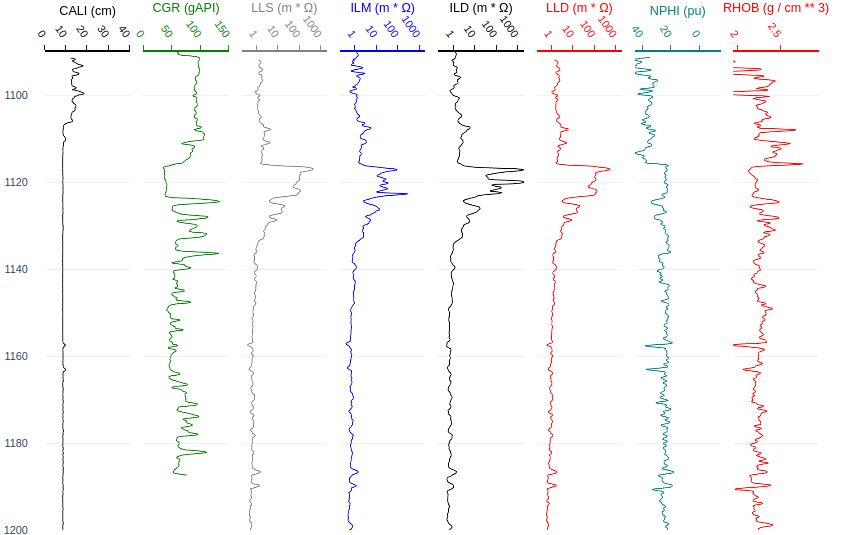
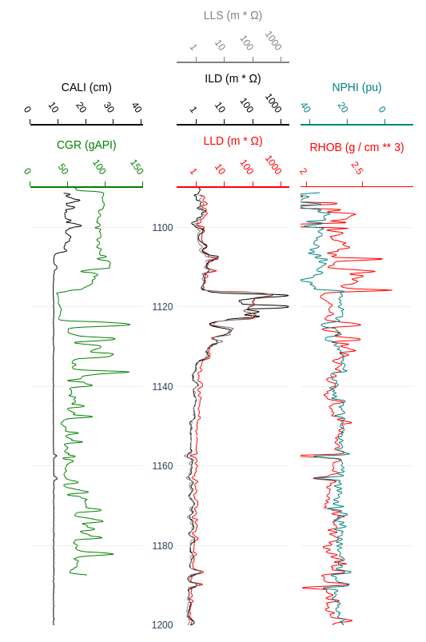

[para español](https://github.com/geopozo/pozo-py/blob/main/docs/es/L%C3%89ANME.md)

# 🐰 Pozo Well Visualizer

Pozo is an open source, intuitive api for visualizing well logs. It uses [plotly](https://github.com/plotly/plotly.py) to render interactive graphs.

```bash
$ pip install pozo
```

Don't forget `pip install lasio` if you're using lasio! If you're using jupyter, `pip install ipywidgets nbformat` as well.

## Simplest Usage

```python
import pozo
import lasio
las = lasio.read("SALADIN.LAS")

# You can specify the data you are interested in
myGraph = pozo.Graph(las, include=["CALI", "CGR", "LLS", "ILD", "LLD", "NPH", "RHOB"])

# This is a good theme
myGraph.set_theme("cangrejo") # recommended theme!

myGraph.render(height=800, depth=[1080, 1180])

```
<p align="center"> </p>

<br />

Notice the tracks are in the same order as your list `include=[...]`.

**We have a new feature! [learn about crossplots](docs/en/users/CROSSPLOTS.md)**

### Combining Tracks
```
# Before you render

graph1.combine_tracks("CGR", "CALI") # Also maintains order!

graph1.combine_tracks("LLD","ILD","LLS") 

graph1.combine_tracks("RHOB", "NPHI")

# Notice we change position of depth axis with `depth_position=1`
graph1.render(height=800, depth_position=1, depth=[1080, 1180])
```
<p align="center"> </p>


A `pozo.Graph` is made up of `pozo.Track`, which is made up of `pozo.Axis`, which is made up of `pozo.Trace`, which contains `data` and `depth`. 

#### Theming

```
# Some possible settings:
#  "color": "blue"
#  "scale": "log"
#  "range": [0, 10]
#  "range_unit": "meter"
```

Themes on more specific items (like `Axis`) override more general items (like `Track`). Calling `set_theme({})` on a `Trace` will override any theme on the `Axis`. If the theme on `Trace` lacks a key, the renderer will look in the `Axis` and so on and so forth.

*Note: Setting themes on `Trace` only works for certain keys, e.g. `Trace` doesn't decide color, `Axis` or above does*

The `"cangrejo"` theme above is a built-in `mnemonic` theme, it changes depending on the mnemonic.
```
# Option One: Set a fallback for everything (only works if theme is set to "cangrejo")
graph.get_theme().set_fallback({"track_width":200})


# Option Two: Set a specific theme on a specific track:
graph.get_tracks("CGR")[0].set_theme({"track_width":200})

```

[learn more about themeing](docs/en/users/THEMING.md)

#### Selecting Tracks

```
# Returns list of Track objects
tracks         = graph1.get_tracks("CGR", "MDP") # by name
other_tracks   = graph1.get_tracks(0, 2)         # by position

# Removes AND returns list of Track of objects
popped_tracks  = graph1.pop_tracks("CGR", 3)     # by name or position

# Note: The name is often the mnemonic. But not always, like in combined tracks.
# To search explicitly by mnemonic:
popped_tracks2 = graph1.pop_tracks(pozo.HasLog("CGR"))
```

## Adding Data Manually

#### Sometimes you want to do your own math and construct your own data:

```
data = [1, 2, 3]
depth = [1010, 1020, 1030]

new_data=Data(data, depth=depth, mnemonic="LOL!")
graph.add_tracks(new_data)
# all data must have either a mnemonic or a name

```
You can now call `graph.add_tracks(new_data)`

But maybe you want to theme it first. Don't theme the "Data" directly, it won't impact much. Instead:

```
new_tracks = graph.add_tracks(new_data)
new_tracks[0].set_theme({"color":"red", range=[0, 1], range_unit="fraction"})
```

[learn more about internals](docs/en/users/INTERNALS.md)

## Sanitizing Data

### Units

`pozo.units.check_las(las_object)` is a function that can help you verify the validy of LAS data. It will list the units it thinks it is and the ranges of values and number of NaNs.
