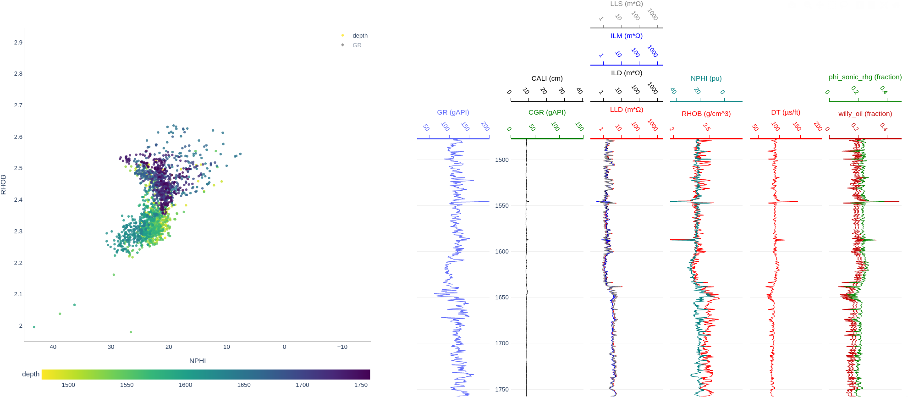

# Crossplots

Los Tracks son trazados creando y manipulando un objeto `pozo.Graph` (podemos llamarle `my_graph`), y entonces llamamos a `my_graph.render()`.


De cualquier forma, los objetos graph pueden también trazar **crossplots**, como este primer ejemplo de densidad vs porosidad:


### Paso 1: Crear un crossplot renderizado:
```python
my_graph.CrossPlot(
	x = graph1.get_data(pozo.HasLog("NPHI")),
	y = graph1.get_data(pozo.HasLog("RHOB")),
	colors = ["depth", graph1.get_track(pozo.HasLog("GR"))],
	xrange=(45, -15),
	yrange=(1.95, 2.945),
	size=800,
	depth_range=(1100, 1300),
)

# x: objeto de pozo que contiene datos del eje x
# y: objeto de pozo que contiene datos del eje y
# colors: lista de objetos de pozo para crear una gama de colores. Puede # incluir "depth" o ser None para no tener colores.
# xrange, yrange: establece los rangos del eje x y el eje y
# size: establece el tamaño del gráfico
# depth_range: filtra el gráfico por profundidad
```

### Paso 2 opción 1:
El renderizador puede ser guardado en una variable y también se puede acceder con `my_graph.xp`.

```python
my_graph.xp.render() # esto se renderizará como un gráfico arriba
```

### Paso 2 opción 2:

También puedes juntar el crossplot con un gráfico regular de los tracks. Esto es bueno porque puedes cambiar fácilmente del rango de profundidad que estás viendo con el crossplot cambiando el rango de profundidad del gráfico de los tracks.

```python
my_graph.render(xp=True) # esto añadirá el crossplot por defecto que creaste en `my_graph.CrossPlot()`
```



También puedes añadir un crossplot diferente si renderizas para esto:

```python
my_graph.render(xp=otro_renderizado_de_crossplot)
```


## Controlando los Gráficos Interactivos

Primero, `pozo` siempre genera objetos tipo `plotly.FigureWidget`, que son gráficos de plotly. Toda la API de plotly para generar los traces, anotaciones, hacer cambios, son permitidos. Puedes acceder al objeto `plotly.FigureWidget` de esta forma:

1) Guardándolo en una variable después de llamar `render()` (render retorna un objeto tipo figura)
2) Accesando a la última figura generada:

```python
my_graph.last_fig

my_graph.xp.last_fig
```
Estos serán `None` si nunca los has renderizado.


### Nota sobre colormaps:

Para mostrar el eje z, nosotros usamos colormaps en nuestros crossplots. Plotly escogerá automáticamente un rango óptimo de colores (Un rango de colores que mostrará los datos en la más alta resolución). El colormap fuciona como un "color zoom".


#### *Ejemplos de malas configuraciones:*

##### Demasiada ampliación (resolución):

Los datos están entre 1-10. Tu escala de colores está entre 4 y 5. Tú no puedes ver todos los datos, esto es algo poco útil y sesgado.

##### Poca ampliación (resolución):

Los datos están entre 1-10. Tu escala de colores está entre -10000 y 10000. Tu resolución es muy alejada, todos los puntos serán del mismo color, esto también es una práctica poco útil y sesgada.

 Cada vez que actualizas el gráfico, ya sea cambiando el rango de profundidad o modificándolo, plotly encontrará el colormap óptimo para tus datos. Esto no siempre es útil cuando queremos cambiar cosas sin cambiar el colormap, ya que intentamos comparar varios gráficos o perspectivas y queremos que compartan el mismo colormap. Revisa las siguientes funciones para controlar este comportamiento:

### Controlando la resolución de datos con colormap:

```python
figure.set_color_range(name, color_range=(None), auto=False, lock=False)
# name: el nombre del trace que quieres (leer de la leyenda)

# establece o un color_range, un auto, o un False.

# color_range=(rango_bajo, rango_alto) funciona como un slice, y fijará los colores mínimo y máximo de esos rangos establecidos

# auto=True hará que plotly descubra la gama de colores por sí mismo nuevamente

# lock=True fijará color_range a los valores actuales mostrados

```
### Configuración manual del rango de profundidades de los crossplots:

```python
figure.set_depth_range(depth_range=None)

# depth_range funciona similar a slice y determinará manualmente el rango de la profunidad.

figure.lock_depth_range() # no permite que el rango de profunidad del crossplot cambie con el gráfico del track

figure.unlock_depth_range() # el rango de profunidades de los cambian con las gráficas de los track, podrán llamar la siguiente función:

figure.match_depth_range() # establece el rango de profundidad del gráfico de crossplot para tomar los gráficos de profundidad del gráfico una vez

```

### Vincular varios gráficos crossplots para realizar un seguimiento de los gráficos:

Si tienes una figura crossplot independiente, tú puedes llamar con:

```python

xpFigure.link_depth_to(otra_figura)

# dónde otra_figura es un gráfico normal de un track

```

Esto ahora hará que el gráfico crossplot independiente se comporte como si estuviera fijado. Puede vincular varios gráficos de crossplot a un gráfico de un track.
